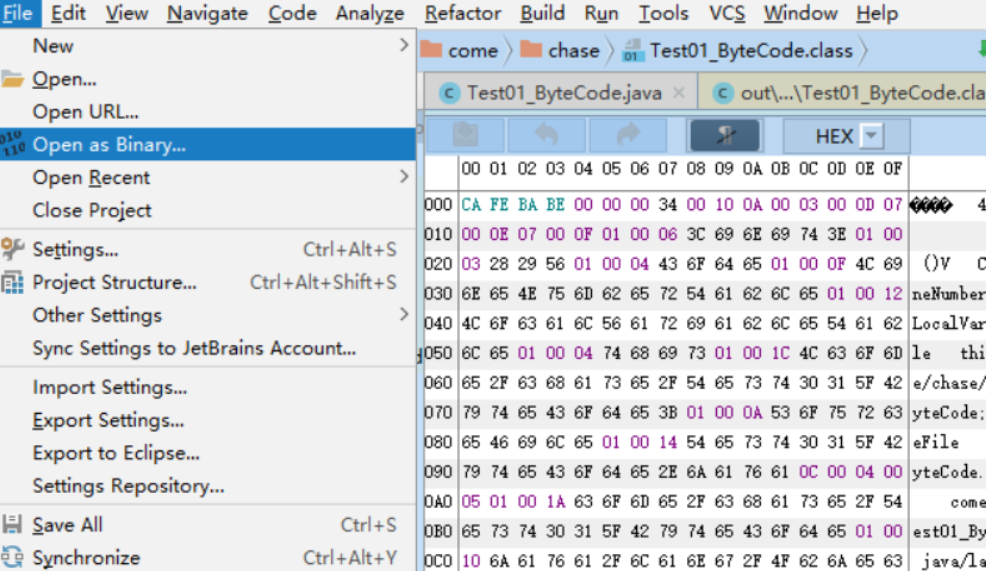
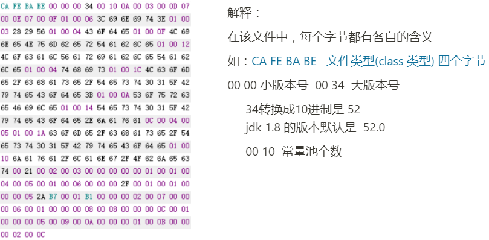
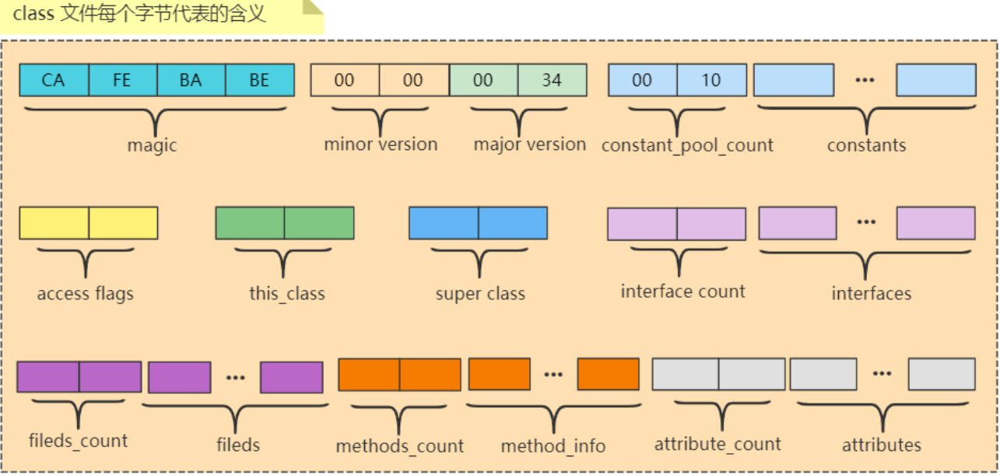
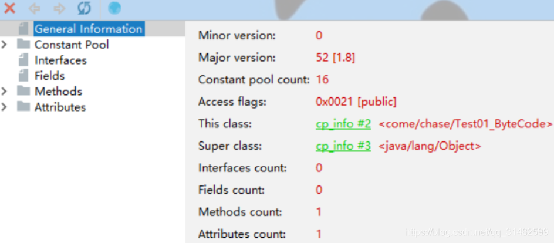

### 概念

Class文件是一组以8字节为基础单位的二进制流，各个数据项目严格的按照顺序紧凑地排列在文件之中，中间没有添加任何分割符，这使得整个Class文件存储的内容几乎全部是程序运行的必要数据，没有空隙存在。

《Java虚拟机规范》规定了Class文件格式采用一种类似C语言结构体的伪结构来存储数据，这种伪结构只包含两种数据类型，即无符号数和表。

class文件通过固定的数据结构排列顺序并且每种数据结构指定了占用的字节长度来紧凑的在组成了完整的可读文件，jvm只需要从文件开始的地方一步一步的读取能够完全的解析出这个类文件的内容。

###数据类型：
u1 u2 u4 u8 和 _info(表类型)

u——unsigned 无符号 ，u 后面的数字表示字节数

### ClassFile 查看方式
可以借助很多工具或者插件查看，比如： sublime/notepad等

IDEA 插件 - BinEd

在Idea界面中，按照如下步骤：File → Open as Binary 就可以查看Class文件对应的十六进制内容

**如下为一个class文件的16进制内容**

**如下是一个Class文件所表示的含义**

### 查看ByteCode的方法

1、javap —— jdk 自带

2、JClassLib - IDEA插件（看着方便）

&nbsp;安装插件——鼠标光标放在类体 —— View —— Show Bytecode With jclasslib 会出现如下

General Information 详细信息

